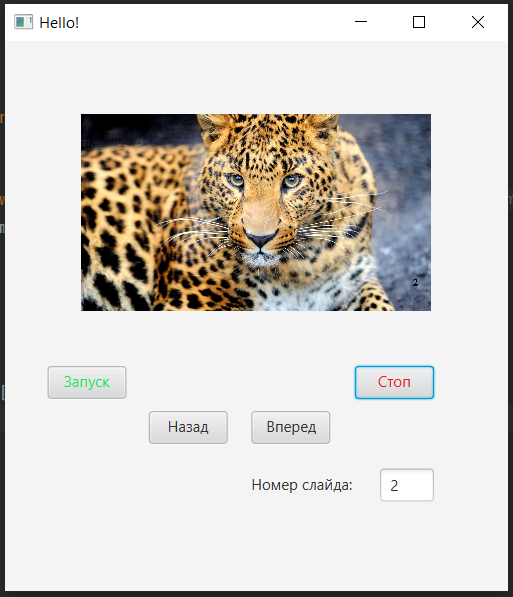

# Task-4
task 4

## В ходе работы были реализованны:
- Aggregate — интерфейс.
- Iterator — интерфейс.
- Класс ImageCollection, реализующий интерфейс Aggregate. 
- Внутренний класс ImageIterator, реализующий интерфейс Iterator.
